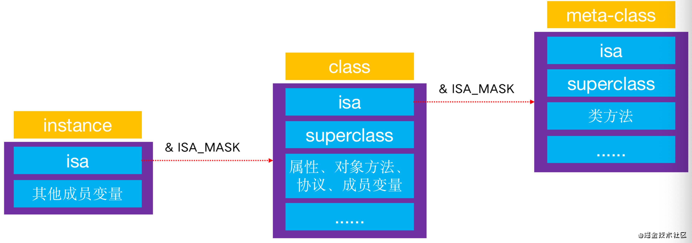

# isa详解

isa指针进行一次位运算才能，拿到class对象和meta-class对象的真实地址。



其实在64位前，isa就是一个普通的指针，存储着class对象、meta-class对象的内存地址。

从64位后开始，对isa进行了优化，变成了一个 **共用体**（union）结构，用不同的位域来存储不同的信息。如图2-1


从上图可以看出，isa是一个共用体（union）结构。

```text
union isa_t {
    Class cls;
    uintptr_t bits;
    // isa一共是64位（8个字节） 右侧第一位一位存放nonpointer，右侧第二位存放has_assoc 。。。。  存储这么多信息一共才占用了8个字节。
    struct {
      ISA_BITFIELD  //这里arm64和x86有所不同
    };
};


# if __arm64__   //真机
#   define ISA_MASK        0x0000000ffffffff8ULL
#   define ISA_MAGIC_MASK  0x000003f000000001ULL
#   define ISA_MAGIC_VALUE 0x000001a000000001ULL
#   define ISA_BITFIELD                                                      
      uintptr_t nonpointer        : 1;                                       
      uintptr_t has_assoc         : 1;                                       
      uintptr_t has_cxx_dtor      : 1;                                       
      uintptr_t shiftcls          : 33; /*MACH_VM_MAX_ADDRESS 0x1000000000*/ 
      uintptr_t magic             : 6;                                       
      uintptr_t weakly_referenced : 1;                                       
      uintptr_t deallocating      : 1;                                       
      uintptr_t has_sidetable_rc  : 1;                                       
      uintptr_t extra_rc          : 19
#   define RC_ONE   (1ULL<<45)
#   define RC_HALF  (1ULL<<18)

# elif __x86_64__  //  模拟器  macos应用
#   define ISA_MASK        0x00007ffffffffff8ULL
#   define ISA_MAGIC_MASK  0x001f800000000001ULL
#   define ISA_MAGIC_VALUE 0x001d800000000001ULL
#   define ISA_BITFIELD                                                       
      uintptr_t nonpointer        : 1;                                       
      uintptr_t has_assoc         : 1;                                       
      uintptr_t has_cxx_dtor      : 1;                                       
      uintptr_t shiftcls          : 44; /*MACH_VM_MAX_ADDRESS 0x7fffffe00000*/ \
      uintptr_t magic             : 6;                                       
      uintptr_t weakly_referenced : 1;                                       
      uintptr_t deallocating      : 1;                                       
      uintptr_t has_sidetable_rc  : 1;                                       
      uintptr_t extra_rc          : 8
#   define RC_ONE   (1ULL<<56)
#   define RC_HALF  (1ULL<<7)
# endif

```

我们看到isa中存储了9个信息一共才占用了8个字节（64位），这就是共用体的优势。我们可以`通过掩码`提取到不同位域中的信息。 我们ios开发需要重点考虑 **arm64** 情况下


nonpointer

* 0：代表普通的指针，存储着Class、Meta-Class对象的内存地址
* 1：代表优化过，使用不同位域存储了不同信息

has\_assoc

* 是否有设置过关联对象，如果没有，释放时会更快

has\_cxx\_dtor

* 是否有C++的析构函数，如果没有，释放时会更快

shiftcls

* 存储着Class、Meta-Class对象的内存地址 这里也解释了**`&ISA_MASK`**才能取到Class、Meta-Class对象的内存地址

magic

* 用于在调试时分辨对象是否完成初始化

weakly\_referenced

* 是否有被弱引用指向过，如果没有，释放时会更快

deallocating

* 对象是否正在释放

extra\_rc

* 里面存储的值是引用计数减1

has\_sidetable\_rc

* 0：引用计数存储在isa的extra\_r所占用位域中
* 1：引用计数过大无法存储在isa中，引用计数存储在一个叫SideTable的类的属性中


